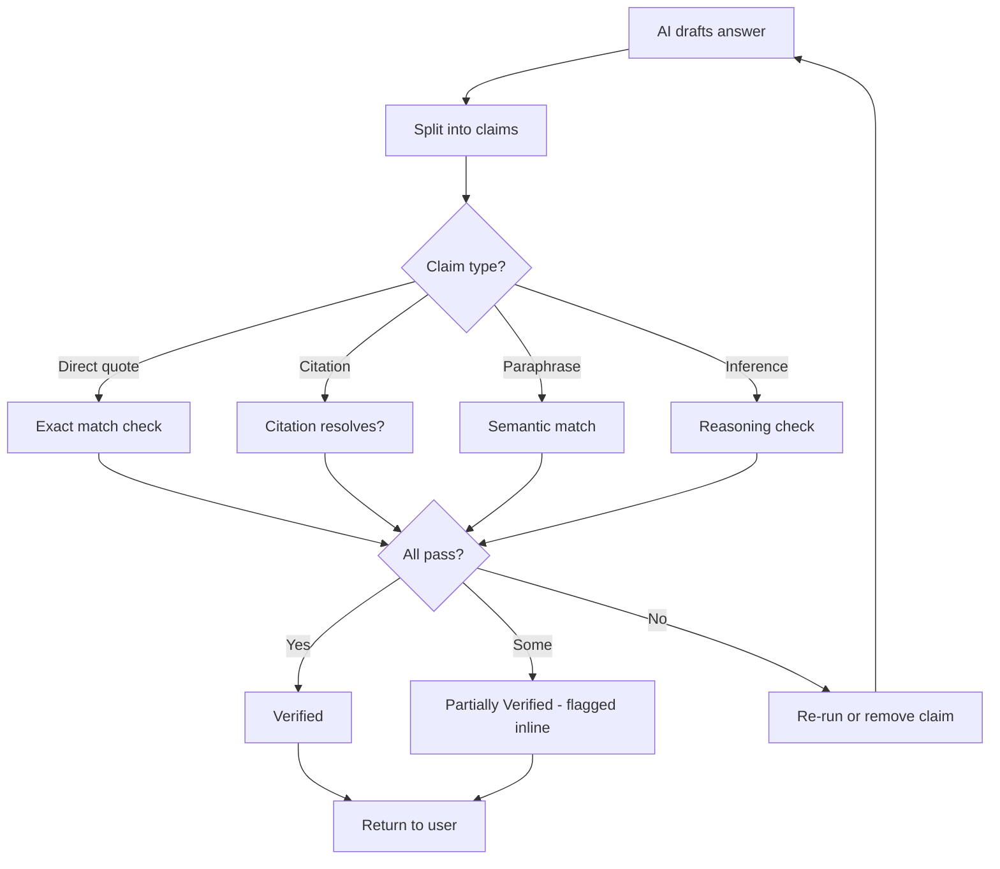

Every answer the AI produces is automatically checked against the actual documents and cases it cited, claim by claim, before you see it. This is not web fact-checking - it verifies that what the model said is actually supported by the sources it pulled.

<Info>
  Verification runs on every standard chat, Deep Research output, Legal Tool result, and Agent Mode final answer. There is nothing to enable - it is on by default.
</Info>

## What Gets Caught

The verification layer is designed to catch the failure modes that matter to lawyers:

| Failure Mode | What It Looks Like |
|------|----------|
| **Fabricated citations** | A case name that does not exist, or a real case cited for a proposition it does not stand for |
| **Wrong numbers or dates** | A statute's effective date off by a year, a damages figure transposed |
| **Missing qualifiers** | "The rule applies in all cases" when the source actually says "in most cases, except..." |
| **Overstated holdings** | A dictum cited as a holding, or a narrow rule extended too broadly |
| **Logical errors** | Conclusions that do not follow from the cited authority |

## How It Works

Each claim in the AI's response is checked against the source it cites:

<Steps>
  <Step title="Exact match">
    For direct quotes, the words must appear in the source verbatim.
  </Step>
  <Step title="Citation validation">
    For case and statute citations, the citation must resolve to a real authority.
  </Step>
  <Step title="Semantic match">
    For paraphrased points, the meaning must be supported by the source passage.
  </Step>
  <Step title="Reasoning check">
    For inferences, the chain of reasoning must hold up against the cited material.
  </Step>
</Steps>

Claims that pass all four are marked **Verified**. Claims that pass some but not others are **Partially Verified**. Claims that fail are flagged or removed before the response reaches you.

## What You See

Each response carries a verification badge:

- **Verified** - Every material claim was fully supported by sources
- **Partially Verified** - Most claims passed; some had weak support and are marked inline
- **Unverified** - One or more material claims could not be backed up - the response shows what failed and why

Hover over any sentence to see which source supports it and at what confidence level.

## Why This Matters

The traditional risk with AI research is that an answer looks polished but contains a hallucinated case or a misstated holding. Verification flips the default: instead of you having to cite-check every paragraph, the system does it first and tells you exactly where to double-check.

You should still confirm critical authorities before filing, but the verification badge tells you where to focus that review.

## When Verification Runs

- Standard chat responses
- Deep Research outputs
- Legal Tool outputs (contract review, NDA triage, compliance check, etc.)
- Agent Mode final answers

## Limits

Verification works against the sources the system retrieved. It cannot:

- Tell you whether a case is still good law (use [Citation Graph](/guides/citation-graph) for precedent freshness)
- Tell you whether a statute has been amended (use [Statutes & Regulations](/guides/statutes-regulations) for amendment history)
- Tell you whether the cited source is itself reliable - that judgment is yours

<Warning>
  A **Verified** badge confirms a claim is supported by the cited source. It does not certify the source itself is current, controlling, or applicable to your facts. Cite-check critical authorities before filing.
</Warning>

Treat verification as a strong filter against fabrication and misquotation, not as a substitute for legal judgment.

## Tips

<Tip>
  **Click through the badge.** The expanded view shows every claim mapped to its source - hover any sentence to see exactly which passage supports it and at what confidence level.
</Tip>

<Tip>
  **Investigate Partially Verified responses first.** These are the spots where the AI hedged or stretched; that is where misstatements hide.
</Tip>

<Tip>
  **Pair with the Citation Graph.** Verification confirms a case was cited correctly; the [Citation Graph](/guides/citation-graph) tells you whether that case is still good law.
</Tip>

## Verify an answer yourself

<Prompt
  description="**Cite-Check** - re-verify an existing answer claim by claim against the actual cited sources."
  icon="circle-check"
  iconType="solid"
  actions={["copy"]}
>
Re-verify the answer above. For each material claim:

1. Pull the cited source using Vaquill and quote the supporting passage verbatim.
2. Mark the claim as **Verified**, **Partially Verified**, or **Unsupported**.
3. For any **Partially Verified** claim, identify which qualifier, exception, or limiting holding the original answer dropped.
4. For any **Unsupported** claim, propose a replacement citation or recommend the claim be removed.
5. Flag any case cited that has been overruled, distinguished, or superseded by statute (run the Citation Graph for each).
6. Flag any statute cited where the version in force at the relevant time differs from the version quoted.

Return a table: **Claim - Source - Status - Action**. End with a one-paragraph reliability summary: is this answer safe to drop into a brief, or does it need substantive rework?
</Prompt>

## Related

<CardGroup cols={2}>
  <Card title="Deep Research Mode" icon="magnifying-glass-plus" href="/guides/deep-research">
    Multi-hop research with built-in verification at each round.
  </Card>
  <Card title="Citation Graph" icon="diagram-project" href="/guides/citation-graph">
    Check whether cited cases are still good law.
  </Card>
  <Card title="Document Search" icon="file-magnifying-glass" href="/guides/document-search">
    How retrieval feeds verification.
  </Card>
  <Card title="Retrieval Strategies" icon="route" href="/guides/retrieval-strategies">
    Pick the strategy that surfaces the right sources before verification runs.
  </Card>
</CardGroup>
