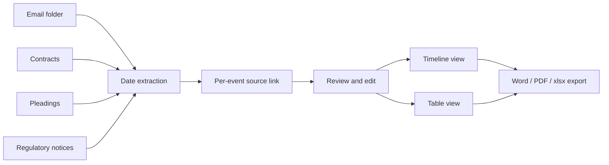

Chronology Builder reads through your documents and pulls out every date, deadline, and event - then organizes them into a single chronological timeline you can hand to a partner, attach to a brief, or work from at trial.

<Frame caption="The document set a chronology is built from: the matter's library, scoped by matter and filtered to the files you want">
  
</Frame>

## When To Use It

<CardGroup cols={2}>
  <Card title="Statement of facts" icon="file-pen">
    Build the chronological backbone of a motion or trial brief in minutes, with every date sourced.
  </Card>
  <Card title="Deposition prep" icon="microphone">
    Lock down the sequence of events before questioning a witness whose account may shift.
  </Card>
  <Card title="Deal reconstruction" icon="handshake">
    Reconstruct a transaction timeline from a folder of emails, contracts, term sheets, and amendments.
  </Card>
  <Card title="Regulatory investigations" icon="magnifying-glass-chart">
    Map subpoenas, audit dates, notices of violation, and response deadlines into one timeline.
  </Card>
  <Card title="Internal investigations" icon="user-secret">
    Trace who knew what and when across a document set during an internal probe.
  </Card>
  <Card title="Matter onboarding" icon="person-walking-arrow-right">
    Walk into a new matter and get the case story fast - the chronology is the partner-level briefing.
  </Card>
</CardGroup>

## How It Works

<Steps>
  <Step title="Upload or pick documents">
    Upload to a matter, or pick documents already in the matter.
  </Step>
  <Step title="Open Chronology Builder">
    Launch from the tools menu inside the matter.
  </Step>
  <Step title="Automatic extraction">
    The tool extracts every dated event and the surrounding context.
  </Step>
  <Step title="Source linking">
    Each event links back to the exact passage in the source document.
  </Step>
  <Step title="Review and edit">
    Add manual events, correct ambiguous dates, merge duplicates, and tag entries.
  </Step>
  <Step title="Export">
    Push to Word memo, PDF, or .xlsx with citations preserved.
  </Step>
</Steps>

## What Gets Extracted

| Event Type | Examples |
|------|----------|
| **Contract dates** | Effective date, term expiration, notice periods, renewal windows |
| **Performance events** | Deliveries, payments, breach notices, cure periods |
| **Communications** | Demand letters, meet-and-confer dates, settlement offers |
| **Litigation milestones** | Filing dates, service of process, discovery deadlines, hearing dates |
| **Regulatory events** | Subpoenas, audit dates, notice of violation, response deadlines |
| **Custom events** | Anything you add manually with your own description |

## Source-Backed Events

Every event in the timeline links back to the exact passage in the source document. Click any event to:

- Open the source document at the page where the event was extracted
- See the highlighted passage that contains the date
- Verify the surrounding context before relying on the entry

If the tool extracts a date you do not need, remove it with one click. If it misses one, add it manually with your own description and source reference.

<Warning>
  Ambiguous dates ("March 2024", "Q3 last year", "the following Tuesday") are extracted as best-effort and flagged. Always confirm the precise date before relying on the entry in a brief or deposition outline.
</Warning>

## Views

<CardGroup cols={2}>
  <Card title="Timeline View" icon="timeline">
    Vertical timeline with dates on the left and event descriptions on the right. Good for presentations and client memos.
  </Card>
  <Card title="Table View" icon="table">
    Sortable, filterable spreadsheet. Filter by date range, document, or event type. Good for working drafts and discovery prep.
  </Card>
</CardGroup>

## Editing the Chronology

- **Add an event** - Insert manual entries that the tool did not extract
- **Edit dates** - Correct ambiguous or partial dates (e.g., "March 2024" can be set to a specific day)
- **Reorder** - Group events that happened on the same day in the order you want
- **Merge** - Combine multiple references to the same event from different documents
- **Tag** - Apply labels like "Disputed", "Privileged", or custom tags for filtering

## Export

| Format | Use Case |
|------|----------|
| **Word (.docx)** | Drop directly into a statement of facts or memo |
| **PDF** | Share with co-counsel or attach to a filing |
| **Spreadsheet (.xlsx)** | Continue working in your own format, or use as an exhibit index |

Each exported chronology preserves the source citations so your team can verify any entry against the underlying document.

## Tips

<Tip>
  **Scope by folder or tag.** Run on a specific subset (only emails, only contracts, only pleadings) for a focused timeline instead of one giant blob.
</Tip>

<Tip>
  **Combine with Matters.** Each matter has its own chronology; you can also pull a single timeline across every document in the case for a full case story.
</Tip>

<Tip>
  **Run iteratively.** Add new documents as discovery comes in and re-run the chronology to see the updated picture - the tool preserves your manual edits across runs.
</Tip>

## Build a chronology

<Prompt
  description="**Chronology Builder** - turn a document folder into a sourced, partner-ready statement of facts."
  icon="timeline"
  iconType="solid"
  actions={["copy"]}
>
Build a chronology from the documents in [folder / matter name].

Do these steps:

1. Extract every dated event - contract dates, performance events, communications, litigation milestones, regulatory events.
2. For each event, capture the **date, actor, action, and one-sentence description**.
3. Link each event back to the **exact passage** in the source document (page and section).
4. Flag any dates that are **ambiguous, disputed, or inferred** rather than stated.
5. Group events that occurred on the same day and order them logically by time of day or sequence.
6. Surface a **gap analysis**: identify periods of more than 30 days with no documented activity that may warrant follow-up discovery.
7. Tag events by category: **Contract, Performance, Communication, Litigation, Regulatory, Disputed**.

Return both views: a clean **statement-of-facts narrative** in chronological prose with footnoted citations, and a **table view** (Date / Actor / Event / Source / Tags) for working drafts. Export-ready for Word and .xlsx.
</Prompt>

## Related

<CardGroup cols={2}>
  <Card title="Matters & Workspaces" icon="folder-open" href="/guides/matters-workspaces">
    Scope documents to a single case.
  </Card>
  <Card title="Document Search" icon="file-magnifying-glass" href="/guides/document-search">
    Ask questions across your matter documents.
  </Card>
  <Card title="Compare Documents" icon="code-compare" href="/guides/document-comparison">
    See how two versions of a document differ.
  </Card>
  <Card title="Document Matrix" icon="table" href="/guides/document-matrix">
    Turn the same document set into a comparative spreadsheet.
  </Card>
</CardGroup>
