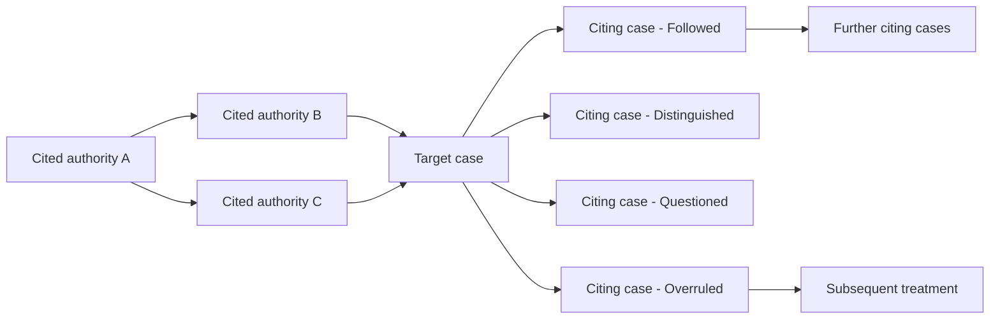

The Citation Graph is an interactive map of how cases cite each other. Pull up any case and see the precedent chain - which decisions it relied on, which decisions have cited it since, and how each citing court treated it. Color-coded so you can spot at a glance whether a case is still good law.

<Frame caption="Every cited authority links to its exact source text">
  
</Frame>

## When To Use It

<CardGroup cols={2}>
  <Card title="Pre-filing cite-check" icon="circle-check">
    Before relying on a case in a brief, confirm it is still good law and has not been overruled, questioned, or superseded.
  </Card>
  <Card title="Map an unsettled doctrine" icon="diagram-project">
    Build the precedent chain when courts are split or the rule is evolving.
  </Card>
  <Card title="Trace back to foundations" icon="route">
    Walk from a recent decision to the foundational authority and see how the doctrine evolved.
  </Card>
  <Card title="Spot recent narrowing" icon="triangle-exclamation">
    Surface decisions in the last few years that have narrowed or distinguished your authority.
  </Card>
  <Card title="Partner walkthrough" icon="user-tie">
    Show a client or partner the strength of a precedent visually before oral argument or strategy calls.
  </Card>
  <Card title="Brief-time defense" icon="shield">
    Anticipate every case the other side will cite by walking the citing-out edges from your authority.
  </Card>
</CardGroup>

## What You See

For any case in the corpus, the graph shows:

- The **target case** at the center
- **Cited authorities** flowing in from one side - cases this opinion relied on
- **Citing cases** flowing out the other side - cases that have cited this one since
- **Edges** between nodes colored by treatment type
- A side panel with case details, the holding, and the cited passages

You can drag, zoom, expand any node into its own graph, and filter by court or year.

## Treatment Types

Each citing case is classified by how it treated the cited case, with edges color-coded by treatment so positive, neutral, and negative citations are easy to spot at a glance:

| Treatment | What It Means |
|------|----------|
| **Followed** | The citing court applied the same rule |
| **Affirmed** | An appellate court affirmed the cited decision |
| **Distinguished** | The citing court found the case did not apply on its facts |
| **Questioned** | The citing court doubted the reasoning without overruling |
| **Overruled** | The citing court (or a higher one) rejected the rule |
| **Superseded** | The rule was changed by statute or rule |
| **Cited** | Cited without explicit treatment - read for context |

A case that has been overruled is flagged at the center node, with the overruling case highlighted.

<Warning>
  Negative treatment can be partial. A case may still be good law for some propositions and bad law for others - always read the overruling or distinguishing opinion to confirm which holdings remain intact before relying on the case.
</Warning>

## Good Law Status

Every case in the graph carries a status indicator:

- **Good Law** - No negative treatment found
- **Distinguished** - Limited but not rejected
- **Questioned** - Doubted by later courts; use with caution
- **Overruled** - Rejected; do not cite for the overruled rule
- **Superseded by Statute** - The rule has been changed legislatively

When you cite a case in a chat response, brief, or memo generated through Vaquill, the precedent status is checked automatically and flagged inline if there is a problem.

## Filtering the Graph

For cases with extensive citation histories, filter the view:

- **By treatment** - Show only overruling cases, only following cases, etc.
- **By court** - Limit to a specific circuit or state appellate court
- **By year** - Focus on the last five years, or the period before/after an amendment
- **By depth** - One hop (direct citations) or expand to two and three hops

## Tracing a Precedent Chain

Click any cited case to make it the new center. The graph re-draws around that case. Use this to trace back from a recent decision to the foundational authority and see exactly how the doctrine evolved.

Pin nodes to keep them visible as you navigate - useful for building a chain of authority for a brief.

## Tips

<Tip>
  **Run before every cite-check.** One pass through the graph catches cases that have been overruled since you last researched the issue - a five-minute habit that prevents brief-killing mistakes.
</Tip>

<Tip>
  **Combine with the Before / After amendment split.** For statutory cases, the graph plus the [statute timeline](/guides/statutes-regulations) together show whether a case is still applicable after the underlying statute changed.
</Tip>

<Tip>
  **Export the chain.** Save the visible graph as PNG or PDF for a partner walkthrough or oral argument prep - judges and senior partners absorb the picture faster than a string cite.
</Tip>

## Map the network around a case

<Prompt
  description="**Citation Network** - full forward + backward map with treatment flags and good-law status."
  icon="diagram-project"
  iconType="solid"
  actions={["copy"]}
>
Build the citation network for **[Case name and citation - e.g., Harlow v. Fitzgerald, 457 U.S. 800 (1982)]**.

Do these steps:

1. List the **cited authorities** the opinion relies on, grouped by the rule each supports.
2. List every **citing case** from the Supreme Court, then by circuit, then by year (most recent first).
3. For each citing case, classify the treatment: **Followed, Affirmed, Distinguished, Questioned, Overruled, Superseded, or Cited**.
4. Flag every negative-treatment case (Questioned, Overruled, Superseded) at the top with a one-line note on what was rejected.
5. Identify the current **Good Law Status** - is the rule from this case still controlling, partially intact, or displaced?
6. Surface any pending cert petitions, en banc rehearings, or proposed legislation that could change the status in the next 12 months.

Return a structured memo: **Case Identity, Cited Authorities, Followed By, Distinguished By, Negative Treatment, Good Law Status, Watchlist**. Cite Vaquill source IDs for every entry.
</Prompt>

## Related

<CardGroup cols={2}>
  <Card title="Case Law Research" icon="gavel" href="/guides/case-law-research">
    Search the full case law corpus before you map it.
  </Card>
  <Card title="Statutes & Regulations" icon="book" href="/guides/statutes-regulations">
    Amendment timelines and judicial interpretations.
  </Card>
  <Card title="Citations" icon="quote-left" href="/guides/citations">
    Manage and format citations across your matter.
  </Card>
  <Card title="Answer Verification" icon="circle-check" href="/guides/answer-verification">
    Verification confirms citations were quoted correctly; the graph confirms they are still good law.
  </Card>
</CardGroup>
