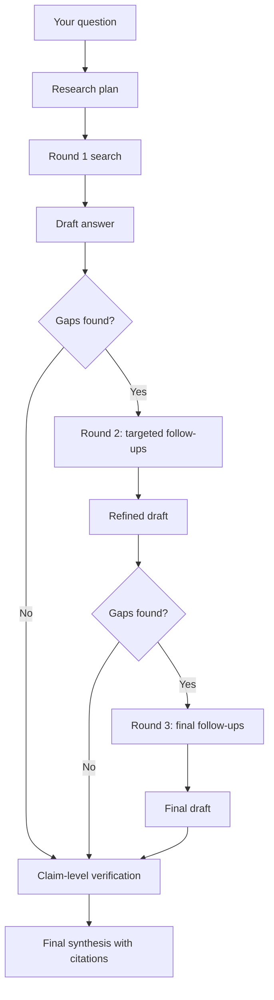

Deep Research Mode is built for the questions that take an associate a full afternoon - the ones where you need to read multiple cases, cross-reference statutes, and synthesize a position. It runs an iterative research loop that drafts an answer, identifies what is missing, runs follow-up searches, and refines.

## When To Use It

Use Deep Research for questions that need more than one pass:

- *"Compare how the Second and Ninth Circuits have treated implied warranty disclaimers in software licenses"*
- *"Walk me through the elements of promissory estoppel in California and identify which our facts satisfy"*
- *"What is the current status of personal jurisdiction over foreign defendants after the recent Supreme Court decisions?"*
- *"Analyze this complaint and tell me which causes of action are strongest given the case law"*

For simpler questions ("what does Section 230 say?"), standard mode is faster and cheaper.

## How It Works

When Deep Research is on, the system:

<Steps>
  <Step title="Plan">
    Reads your question and generates an initial research plan.
  </Step>
  <Step title="Round 1 retrieval">
    Runs the first round of searches across your documents, case law, and statutes.
  </Step>
  <Step title="Draft">
    Produces a preliminary answer from the retrieved sources.
  </Step>
  <Step title="Gap analysis">
    Reviews the draft for missing authorities, weak reasoning, and counter-arguments.
  </Step>
  <Step title="Follow-up rounds">
    Generates targeted queries for the gaps; repeats up to three rounds.
  </Step>
  <Step title="Synthesis">
    Returns a final answer with every source cited and verification badges applied.
  </Step>
</Steps>

## Higher Retrieval Limits

Deep Research pulls a larger pool of candidate sources before narrowing down - so the model can compare more authorities and pick the best ones rather than working with the first few that match.

| Setting | Standard Mode | Deep Research |
|------|------|------|
| Candidate sources per query | Standard pool | Expanded pool |
| Follow-up queries | None | Up to 3 rounds |
| Cross-document synthesis | Single pass | Iterative |
| Best for | Direct questions | Comparative analysis |

## Gap Analysis Between Rounds

After each round, the system asks itself: *"What is this draft missing? Are there counter-authorities? Is there a temporal issue? Are the cases still good law?"* The follow-up queries it generates are aimed at those gaps, not just at re-searching the original question.

You can see the intermediate reasoning steps in the response - what was searched, what was found, and what was decided.

## Hallucination Guard

Each round runs through claim-level verification before the answer is returned. If the model writes a sentence that is not actually supported by the retrieved sources, the system flags it and re-runs that section. See [Answer Verification](/guides/answer-verification) for how this works.

## When To Turn It Off

- Quick lookups ("what is the citation for Marbury v. Madison?")
- Drafting tasks that do not need research ("draft me an NDA")
- Conversational follow-ups inside an existing thread

<Warning>
  Deep Research is slower and burns more credits per question than standard mode. Reserve it for the questions where the depth genuinely pays off - comparative analysis, unsettled doctrine, fact-driven motion practice.
</Warning>

Deep Research is slower and more expensive per question. Use it where the depth pays off.

## How To Enable

Click the **Deep Research** toggle in the chat composer. The toggle saves per matter, so if you turn it on for a litigation matter, it stays on while you work in that workspace.

## Tips

<Tip>
  **Be specific about jurisdiction.** "California state courts" produces a tighter answer than "California". For federal questions, name the circuit.
</Tip>

<Tip>
  **Anchor to your facts.** Paste the key facts of your matter into the question; Deep Research will tie the analysis directly to them instead of returning a textbook summary.
</Tip>

<Tip>
  **Run inside a matter.** When the matter has documents uploaded (complaint, contracts, deposition transcripts), Deep Research pulls from them alongside the public corpus.
</Tip>

## Deep Research prompt

<Prompt
  description="**Deep Research** - comparative circuit analysis applied to your facts, with counter-authorities surfaced."
  icon="magnifying-glass-plus"
  iconType="solid"
  actions={["copy"]}
>
Run a deep research analysis on the following question for our matter.

**Question:** [Insert your question - e.g., "Does our client's social media monitoring program of remote employees survive an intrusion upon seclusion claim under California law?"]

**Our facts:** [Paste the 3-5 key facts]

Do these steps in order:

1. Identify the controlling law and jurisdiction (state, circuit, statutory framework).
2. Pull the leading cases - both supporting and contra - from the controlling jurisdiction, then from persuasive jurisdictions.
3. For each case, give the holding, the key facts, and how it compares to ours.
4. Surface any counter-authorities or unfavorable cases the other side would cite.
5. Apply the law to our facts and give a likelihood assessment (Strong / Moderate / Weak / Untested).
6. Flag any unsettled questions, recent Supreme Court grants of cert, or pending legislation that could change the analysis.
7. Cite-check every authority via the Citation Graph and flag anything overruled, questioned, or superseded.

Return a memo-quality output: **Issue, Short Answer, Discussion (with subheadings), Conclusion**. Every factual claim must carry a Vaquill source citation.
</Prompt>

## Related

<CardGroup cols={2}>
  <Card title="Agent Mode" icon="robot" href="/guides/agent-mode">
    Tool-using research with web search and URL fetching.
  </Card>
  <Card title="Answer Verification" icon="circle-check" href="/guides/answer-verification">
    How claims are checked against sources at every round.
  </Card>
  <Card title="Retrieval Strategies" icon="route" href="/guides/retrieval-strategies">
    The different ways the system finds relevant sources.
  </Card>
  <Card title="Citation Graph" icon="diagram-project" href="/guides/citation-graph">
    Confirm cited cases are still good law before relying on them.
  </Card>
</CardGroup>
