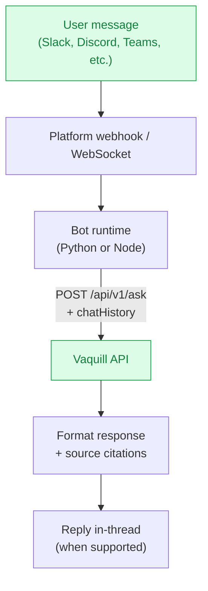

Six chat platforms, one architecture. Each bot maintains per-channel (or per-DM) conversation history, calls the Vaquill API, renders structured source citations, and enforces per-user rate limits.

<CardGroup cols={2}>
  <Card title="Slack" icon="slack" href="/integrations/chatbots/slack">
    `@mentions`, slash commands, DMs, thread context, feedback buttons. Socket Mode or HTTP.
  </Card>
  <Card title="Discord" icon="discord" href="/integrations/chatbots/discord">
    Prefix commands, per-channel history, pagination, starter questions, role and channel allowlists.
  </Card>
  <Card title="Microsoft Teams" icon="microsoft" href="/integrations/chatbots/microsoft-teams">
    Adaptive Cards, thread support, tenant allowlists, Azure-native deployment.
  </Card>
  <Card title="Telegram" icon="telegram" href="/integrations/chatbots/telegram">
    BotFather setup, markdown tables rendered as PNG, inline source buttons, polling or webhook.
  </Card>
  <Card title="WhatsApp" icon="whatsapp" href="/integrations/chatbots/whatsapp">
    Twilio-based, FastAPI server, slash commands for mode/language switching, sandbox to production path.
  </Card>
  <Card title="Signal" icon="signal-messenger" href="/integrations/chatbots/signal">
    signal-cli-rest-api backend, Docker Compose deploy, primary or linked-device registration.
  </Card>
</CardGroup>

## Shared architecture

Every chatbot follows the same flow:

All six bots share:

- **Vaquill client** (`vaquill_client.py`) that wraps `POST /api/v1/ask`
- **Conversation manager** for per-channel or per-DM chat history
- **Rate limiter** with Redis or in-memory backend
- **Slash / prefix commands**: `help`, `clear`, `examples`, `stats`
- **Source citation rendering** appropriate to each platform's primitives (Block Kit, Adaptive Cards, inline keyboards, etc.)

## Pick by deployment surface

| Bot | Hosting model | Public URL required? |
|---|---|---|
| Slack | Socket Mode (no URL) or HTTP | HTTP mode only |
| Discord | Long-poll | No |
| Microsoft Teams | HTTP via Azure Bot Framework | Yes |
| Telegram | Polling or webhook | Webhook mode only |
| WhatsApp | HTTP via Twilio webhooks | Yes |
| Signal | HTTP via signal-cli-rest-api | No (internal Docker network) |

If you want zero exposed ports during development, Slack (Socket Mode), Discord, Telegram (polling), and Signal all run without a public URL.

## Deploy targets

All six bots ship with Dockerfiles and have been smoke-tested on:

- **Docker Compose** (recommended for self-hosting)
- **Railway** (Git-based deploys)
- **Render** (free tier with cold starts)
- **Fly.io** (low-latency regions)
- **VPS + systemd** (full control)
- **Azure App Service** (Teams bot only)

Each bot's page lists its specific deployment recipe.

## Source

All chatbot code lives at [github.com/Vaquill-AI/integrations](https://github.com/Vaquill-AI/integrations) under one subdirectory per platform. Fork the repo, edit one bot, redeploy.
