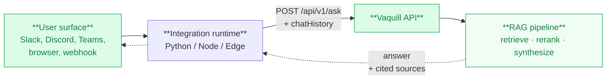

Put Vaquill wherever your team already works - Claude, Slack, a marketing site, a Google Sheet. Every integration is open-source, self-hostable, and calls the same [Vaquill API](/api-reference/ask/ask-a-legal-question) under the hood.

<CardGroup cols={2}>
  <Card title="MCP Servers" icon="plug" href="/integrations/mcp">
    Plug US statutes, CourtListener, CanLII, and Vaquill's full corpus into Claude, Cursor, VS Code, or any MCP client.
  </Card>
  <Card title="Chatbots" icon="comments" href="/integrations/chatbots">
    Legal Q&A in Slack, Discord, Microsoft Teams, Telegram, WhatsApp, or Signal with thread memory and cited sources.
  </Card>
  <Card title="Widgets" icon="window" href="/integrations/widgets">
    Embed a chat widget on any site - one script tag, an iframe, or a full Next.js deployment with voice and history.
  </Card>
  <Card title="Browser Extensions" icon="puzzle-piece" href="/integrations/browser/chrome">
    Research from any browser tab without leaving the page. Chrome, Edge, Brave, Arc, Opera.
  </Card>
  <Card title="Automation" icon="gears" href="/integrations/automation/n8n">
    n8n and Make.com templates that turn a Google Sheet of questions into a Sheet of answers and cited sources.
  </Card>
  <Card title="GitHub" icon="github" href="https://github.com/Vaquill-AI/integrations">
    Every integration is MIT-licensed and ready to fork.
  </Card>
</CardGroup>

## Pick an integration

| If you want to... | Use |
|---|---|
| Ask legal questions from Claude / Cursor / VS Code | [Vaquill MCP](/integrations/mcp/vaquill) |
| Search US federal + state case law from an AI tool | [CourtListener MCP](/integrations/mcp/courtlistener) |
| Search Canadian case law from an AI tool | [CanLII MCP](/integrations/mcp/canlii) |
| Add legal Q&A to your Slack workspace | [Slack bot](/integrations/chatbots/slack) |
| Add legal Q&A to your Discord server | [Discord bot](/integrations/chatbots/discord) |
| Add legal Q&A to Microsoft Teams | [Microsoft Teams bot](/integrations/chatbots/microsoft-teams) |
| Add legal Q&A to Telegram | [Telegram bot](/integrations/chatbots/telegram) |
| Add legal Q&A to WhatsApp | [WhatsApp bot](/integrations/chatbots/whatsapp) |
| Add legal Q&A to Signal | [Signal bot](/integrations/chatbots/signal) |
| Embed a chat widget on a marketing site | [Embedded Chat Widget](/integrations/widgets/embedded-chat) |
| Self-host a chat widget with Docker | [Docker Widget](/integrations/widgets/docker-widget) |
| Run a feature-rich widget with voice + history sidebar | [Widget Pro](/integrations/widgets/widget-pro) |
| Research from any browser tab | [Chrome Extension](/integrations/browser/chrome) |
| Batch-process legal questions from a Google Sheet | [n8n / Make.com](/integrations/automation/n8n) |

## Common architecture

Every integration is a thin wrapper: take input from the surface (Slack message, browser popup, webhook), call `POST /api/v1/ask`, render the answer with cited sources.

One API key (`vq_key_...`) from your [dashboard](https://app.vaquill.ai/settings) drives them all. Configuration is via environment variables; every integration ships with a Dockerfile and at least one cloud-deploy recipe.

## Build your own

To add a surface we do not ship (Outlook, Notion, a CRM, an internal portal):

1. Generate a key in your [dashboard](https://app.vaquill.ai/settings).
2. `POST /api/v1/ask` with `{ "question": "..." }` and `Authorization: Bearer vq_key_...`.
3. Render `data.answer`; iterate `data.sources` for citations (case name, court, citation, PDF link).
4. Maintain `chatHistory` client-side for multi-turn threads.

See [Authentication](/authentication) for key setup and [Errors](/errors) for status-code handling.
